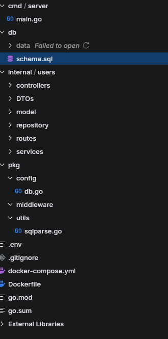

# 🚀 Backend Go Starter Kit

### **`backend-go`**: Script para inicializar backends Go (Fiber) con una arquitectura moderna, dockerizado y listo para el desarrollo rápido.

| Característica | Descripción |
| :--- | :--- |
| **Arquitectura** | Estructura de carpetas (`cmd`, `pkg`, `internal`) recomendada. |
| **Stack** | Go, Fiber v2, y soporte nativo para **PostgreSQL**. |
| **Dev Tools** | Hot reload configurado con **Air**. |
| **Utilidades** | Funciones para generar consultas SQL (**INSERT** y **UPDATE** dinámicas). |
| **Producción** | Archivos `Dockerfile` multietapa y `docker-compose.yml` preconfigurados. |

***

## ⚙️ REQUISITOS

Para ejecutar el script y el proyecto generado, solo necesitas estas herramientas base:

| Icono | Herramienta | Versión Mínima | Instalación |
| :--- | :--- | :--- | :--- |
|  | **Go** | **1.25+** | [go.dev/dl/](https://go.dev/dl/) |
|  | **Docker & Compose** | Última estable | [docs.docker.com](https://docs.docker.com/get-docker/) |
|  | **Git** | N/A | [git-scm.com](https://git-scm.com/downloads) |

***

## 💻 INSTALACIÓN (Script Global)

Sigue estos pasos para instalar y hacer que el comando `backend-go` esté disponible globalmente en tu sistema.

1. **Clona el repositorio:**
    ```bash
    git clone https://github.com/Nn3z/script-create-go-back.git
    cd script-create-go-back
    ```

2. **Instala el script como comando global:**
    ```bash
    sudo cp backend-go /usr/local/bin/
    sudo chmod +x /usr/local/bin/backend-go
    ```

### 🔄 Actualización

Como el proyecto está en fase Beta, la forma más sencilla de actualizar el script es:

```bash
cd script-create-go-back # Ve al directorio donde clonaste el repo
git pull                 # Descarga los últimos cambios
sudo cp backend-go /usr/local/bin/ # Sobrescribe la versión global
```

## USO DEL SCRIPT

### Inicia el script

```bash
backend-go init
```

### Sigue los pasos que te va indicando el script
### Te generará una estructura parecida a la siguiente

<p align="center">
  
</p>

### Entra a la carpeta del proyecto generado

```bash
cd NOMBRE_DE_LA_CARPETA
```

### Instala las dependencias de Go y asegúrate de que go.sum esté completo

```bash
go mod tidy
```

### Inicia Docker Compose para iniciar la base de datos y el backend

```bash
docker compose up -d --build
```

### (SOLO PARA DESARROLLO)
### Ejecuta el proyecto con Air

```bash
air
```

# GRACIAS POR EL APOYO ❤️❤️❤️

## Pueden echar un vistazo al roadmap para saber el contenido de las siguientes actualizaciones 🤩🤩🤩

[ROADMAP.md](ROADMAP.md)

#### Recuerden que este es un proyecto personal, así que tardará en subirse cambios 🙃
